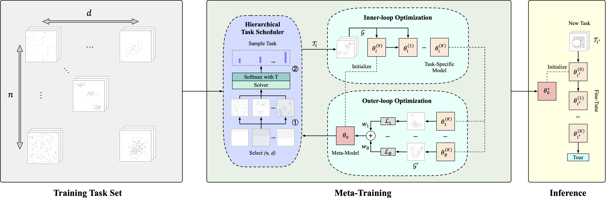
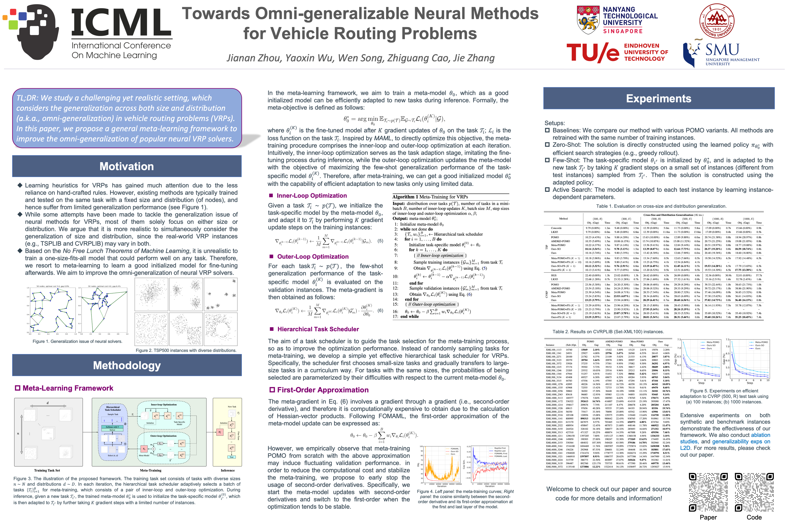

<h1 align="center"> Towards Omni-generalizable Neural Methods for Vehicle Routing Problems </h1>

<p align="center">
      <a href="https://openreview.net/forum?id=PlFBOnVOFg"></a>&nbsp;&nbsp;&nbsp;&nbsp;<a href="https://icml.cc/virtual/2023/poster/25267"></a>&nbsp;&nbsp;&nbsp;&nbsp;<a href="https://hits.seeyoufarm.com"></a>&nbsp;&nbsp;&nbsp;&nbsp;<a href="https://github.com/RoyalSkye/Omni-VRP/blob/main/LICENSE"></a>
  </p>

The PyTorch Implementation of *ICML 2023 Poster -- "Towards Omni-generalizable Neural Methods for Vehicle Routing Problems"* by [Jianan Zhou](https://royalskye.github.io), [Yaoxin Wu](https://research.tue.nl/en/persons/yaoxin-wu), [Wen Song](https://songwenas12.github.io), [Zhiguang Cao](https://zhiguangcaosg.github.io), [Jie Zhang](https://personal.ntu.edu.sg/zhangj).

<p align="center"></p>

### TL;DR

This paper studies a challenging and realistic setting, which considers generalization across both size and distribution (a.k.a. omni-generalization) of neural methods in VRPs. Technically, a general meta-learning framework is developed to tackle it.

<p align="center">
  
</p>

### Env Setup

```shell
conda create -n omni_vrp python=3.8
conda activate omni_vrp
# install pytorch (we use V.1.12.1), see here: https://pytorch.org/get-started/previous-versions
conda install pytorch==1.12.1 torchvision==0.13.1 torchaudio==0.12.1 cudatoolkit=11.3 -c pytorch
conda install pytz tqdm scikit-learn matplotlib
# for L2D env setup, see here: https://github.com/mit-wu-lab/learning-to-delegate
```

### How to Run

We take the meta-training on POMO as an example. See [here](https://github.com/RoyalSkye/Omni-VRP/tree/main/L2D) for L2D.

```shell
# 1. Training
# a. second-order
nohup python -u train.py 2>&1 &
# b. early-stopping
meta_params['meta_method'] = "maml_fomaml"
# c. first-order
meta_params['meta_method'] = "fomaml"

# 2. Testing
# a. zero-shot on datasets (.pkl)
nohup python -u test.py 2>&1 &
# b. few-shot on datasets (.pkl), including 1K test instances and 1K fine-tuning instances.
fine_tune_params['enable'] = True
# c. zero-shot on benchmark instances (.tsp or .vrp)
tester_params['test_set_path'] = "../../data/TSP/tsplib"

# 3. Traditional baselines (VRP solvers) ["concorde","lkh"] for TSP; ["hgs", "lkh"] for CVRP
nohup python -u TSP_baseline.py --method "lkh" --cpus 32 --no_cuda --disable_cache 2>&1 &

# 4. Neural baselines
# Note: For AMDKD-POMO, refer to: https://github.com/jieyibi/AMDKD
meta_params['enable'] = False  # POMO
meta_params['meta_method'] = 'reptile'  # Meta-POMO

# 5. Efficient active search (EAS)
# Note: change -instances_path to the folder path if conducting EAS on benchmark instances
# Note: Pls carefully check parameters, e.g., -norm, -round_distances, etc.
nohup python -u run_search.py 2>&1 &
```

#### Options

```shell
# Modify the default value in train.py
# 1. Bootstrapped Meta-Learning - ICLR 2022
meta_params['L'] = X (X > 0)

# 2. ANIL (Almost No Inner Loop) - ICLR 2020
model_params["meta_update_encoder"] = False

# 3. Meta-training on the pretrained model
# Note: The type of normalization layers should match (search for model_params["norm"])
# Supported normalization layers: ["no", "batch", "batch_no_track", "instance", "rezero"]
trainer_params['pretrain_load'] = True

# 4. Resume meta-training 
trainer_params['model_load'] = True

# 5. No task scheduler
meta_params['curriculum'] = False
```

#### Pretrained

For reference, we provide [pretrained](https://github.com/RoyalSkye/Omni-VRP/tree/main/pretrained) models on uniform instances following POMO, and meta-pretrained models on 32M instances. Some of them may be outdated. To fully reproduce the results, please retrain the model following the above commands.

### Discussions

In summary: 1) Normalization layers matter in AM-based models (see [here](https://github.com/RoyalSkye/Omni-VRP/blob/main/POMO/TSP/TSPTrainer_meta.py#L58)); 2) The training efficiency and scalability heavily depend on the base model and meta-learning algorithm; 3) It may be better to conduct meta-training on the pretrained model. For further discussions, refer to Appendix E.

### Acknowledgments

* We would like to thank the anonymous reviewers and (S)ACs of ICML 2023 for their constructive comments and dedicated service to the community. The reviews and meta-review are available [here](https://github.com/RoyalSkye/Omni-VRP/blob/main/Reviews_ICML23.md).

* We also would like to thank the following repositories, which are baselines of our code:

  * https://github.com/wouterkool/attention-learn-to-route

  * https://github.com/yd-kwon/POMO

  * https://github.com/mit-wu-lab/learning-to-delegate

  * "On the generalization of neural combinatorial optimization heuristics"


### Citation

If you find our paper and code useful, please cite our paper:

```tex
@inproceedings{zhou2023towards,
title       ={Towards Omni-generalizable Neural Methods for Vehicle Routing Problems},
author      ={Jianan Zhou and Yaoxin Wu and Wen Song and Zhiguang Cao and Jie Zhang},
booktitle   ={International Conference on Machine Learning},
year        ={2023}
}
```
